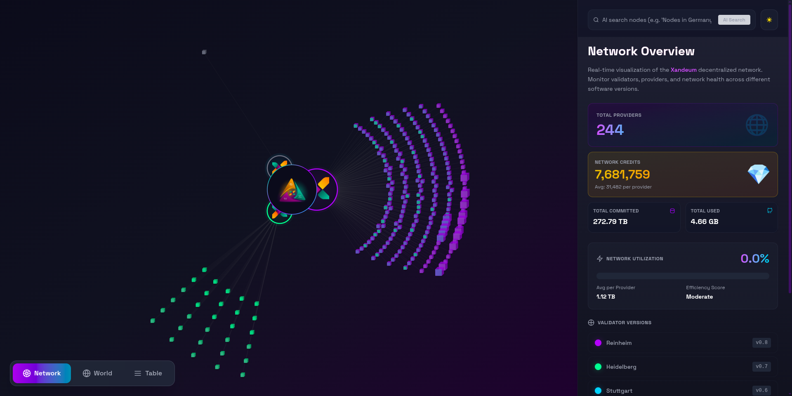
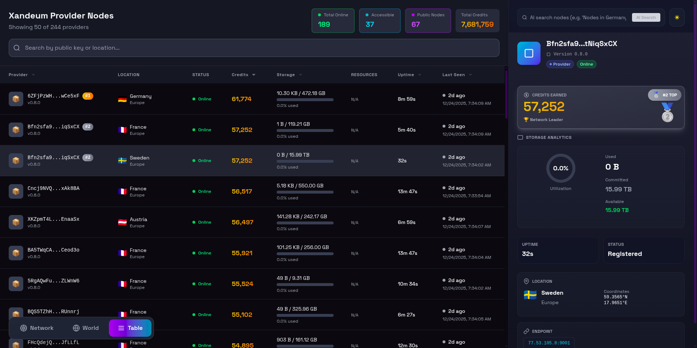
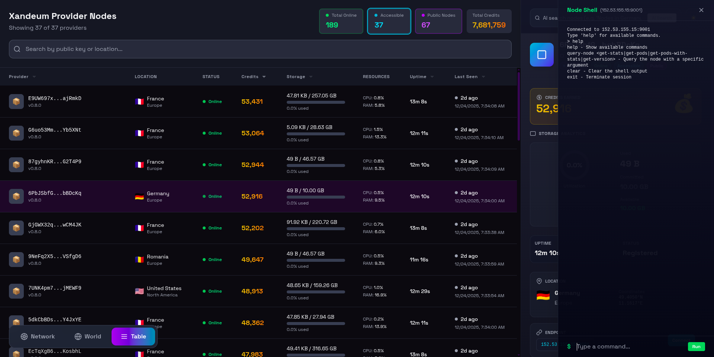
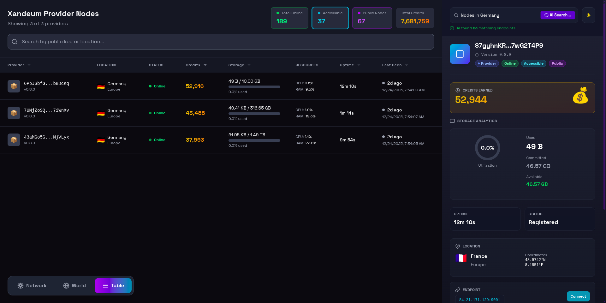

<div align="center">
  <h1>
    <b>Xandeum Analytics Dashboard</b>
    
  </h1>
</div>

## **Project Overview:**

This is the frontend for the [Xandeum](https://www.xandeum.network/) analytics dashboard, built on top of this [backend repo](https://github.com/zenon8adams/xandeum-network-backend.git).

It’s built with Vite, React, and TypeScript, and focuses on making Xandeum’s network data easy to explore — including provider node (pNode) performance, overall storage and usage, node credits, geographic distribution, and an AI-powered chat for querying network insights.

---

### **Key Features**

- **Interactive network view:** A dedicated _Network_ page with a D3-based cluster graph showing pNodes and the versions they’re running.
- **Table & world views:** Separate pages to explore all pNodes either in a structured table or plotted on a global map.
- **Node shell:** An in-app shell that lets you run commands against public pNode endpoints to fetch live stats and status directly from the UI.
- **Sidebar details:** Rich, contextual info for selected nodes, including storage, uptime, location, public endpoint, node status, and credit ranking.
- **AI-powered chat:** Explore network insights and metrics using simple, natural-language queries.

---

<br/>

### Demo Video

[](https://github.com/zenon8adams/xandeum-dashboard/blob/master/public/assets/xandeum-demo.mp4)
---

### **Quick Start**

Prerequisites:

- Node.js 18+ (or current LTS)
- npm or yarn

Install and run locally:

```bash
git clone <repo-url>
cd xandeum-dashboard
# install
yarn install

# create .env (see below)
# development
yarn start

# build
yarn build

```

Environment

- The app requires `VITE_API_BASE_URL` to point to the backend API (example below).

Example `.env`

```env
VITE_API_BASE_URL=http://localhost:8000/api
```

---


**Environment & Configuration**

- The base API URL is read from `import.meta.env.VITE_API_BASE_URL`. Set this in a `.env` file at the repo root before running the dev server.

**Development notes**

- Data polling intervals are configured in `src/hooks/useNodes.ts` (currently refetch interval 60s).
- The network graph computes layout client-side (D3) using aggregated data provided by the API.

## Docs

### Network View
The Network View arranges nodes in a dynamic graph. The parent nodes represent major release versions, and the leaves attached to each parent represent nodes running minor or exact versions for that release. This visualization helps you understand the structure and distribution of nodes across different software versions.


### Sidebar
The sidebar displays detailed information about a node. Hovering over any node in the network graph will show its information in the sidebar, including version, status, and other metadata.

### World View
The World View displays nodes on a map, grouped by their closest known geographic location. This helps visualize the global distribution of nodes and identify regional clusters or outliers.


### Table View
The Table View presents all node information in a sortable, filterable tabular format. This is useful for searching, comparing, and exporting node data.



### Console (Terminal View)
The console allows users to connect to accessible nodes and run commands. Pressing the help button in the terminal will show all supported commands. Currently supported commands include:
- `get-version`
- `get-stats`
- `get-pods-with-stats`
- `get-pods`



### AI Search
AI search is deeply integrated into the application. You can search for nodes or prompt for information in any view, and the results will propagate to all other views. This allows for seamless, intelligent exploration and analysis of the network.



### Accessible Nodes
Nodes that are public should be world-accessible, but some may be blocked by firewalls. The application maintains an index of accessible nodes and highlights them. Users can connect to these nodes through the terminal for direct interaction.
