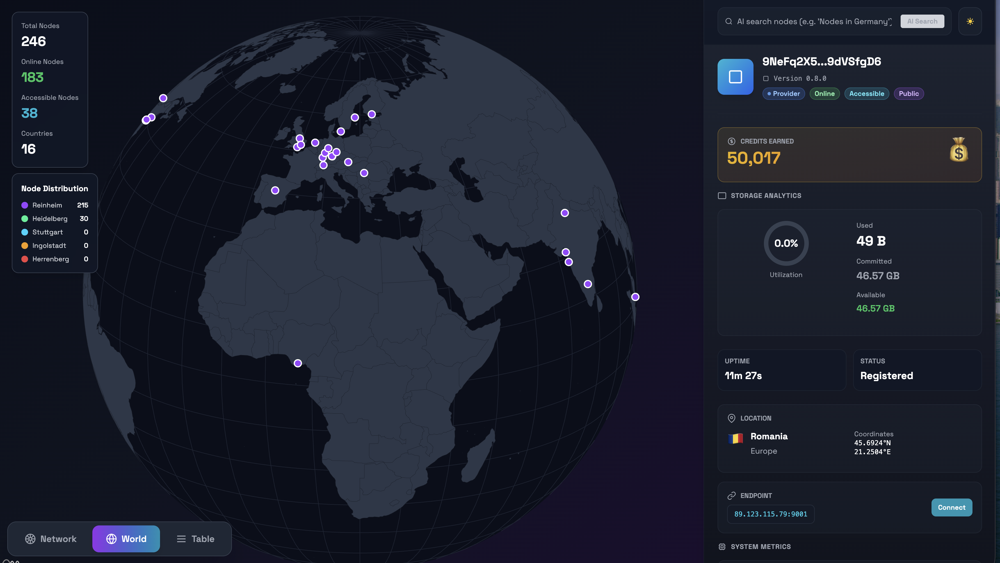

<div align="center">
  <h1>
    <b>Xandeum Analytics Dashboard</b>
    
  </h1>
</div>

## **Project Overview:**

This is the frontend for the [Xandeum](https://www.xandeum.network/) analytics dashboard, built on top of this [backend repo](https://github.com/zenon8adams/xandeum-network-backend.git).

It’s built with Vite, React, and TypeScript, and focuses on making Xandeum’s network data easy to explore — including provider node (pNode) performance, overall storage and usage, node credits, geographic distribution, and an AI-powered chat for querying network insights.

---

### **Key Features**

- **Interactive network view:** A dedicated _Network_ page with a D3-based cluster graph showing pNodes and the versions they’re running.
- **Table & world views:** Separate pages to explore all pNodes either in a structured table or plotted on a global map.
- **Node shell:** An in-app shell that lets you run commands against public pNode endpoints to fetch live stats and status directly from the UI.
- **Sidebar details:** Rich, contextual info for selected nodes, including storage, uptime, location, public endpoint, node status, and credit ranking.
- **AI-powered chat:** Explore network insights and metrics using simple, natural-language queries.

---

<br/>

  

---

### **Quick Start**

Prerequisites:

- Node.js 18+ (or current LTS)
- npm or yarn

Install and run locally:

```bash
git clone <repo-url>
cd xandeum-dashboard
# install
npm install

# create .env (see below)
# development
yarn start

# build
yarn build

```

Environment

- The app requires `VITE_API_BASE_URL` to point to the backend API (example below).

Example `.env`

```env
VITE_API_BASE_URL=http://localhost:8000/api
```

---

### **Important files & folders**

- **[src/App.tsx](src/App.tsx)**: Main app layout and view switching
- **[src/index.tsx](src/index.tsx)**: App bootstrap and `QueryProvider`
- **[src/components/NetworkGraph.tsx](src/components/NetworkGraph.tsx)**: D3 network visualization
- **[src/components/Sidebar.tsx](src/components/Sidebar.tsx)**: Node details, charts and AI search UI
- **[src/components/ApiDataIntegrator.tsx](src/components/ApiDataIntegrator.tsx)**: Bridges react-query data to app
- **[src/hooks/useNodes.ts](src/hooks/useNodes.ts)**: React Query hooks for root and leaf nodes
- **[src/api/client.ts](src/api/client.ts)**: Axios client + API helpers + `smartQuery`
- **[src/utils](src/utils)**: helpers, aggregation, IP utils, formatting

**Environment & Configuration**

- The base API URL is read from `import.meta.env.VITE_API_BASE_URL`. Set this in a `.env` file at the repo root before running the dev server.

**Development notes**

- Data polling intervals are configured in `src/hooks/useNodes.ts` (currently refetch interval 60s).
- The network graph computes layout client-side (D3) using aggregated data provided by the API.

**Testing**

- Unit tests use `vitest`. Run:

```bash
yarn run test
```

---
